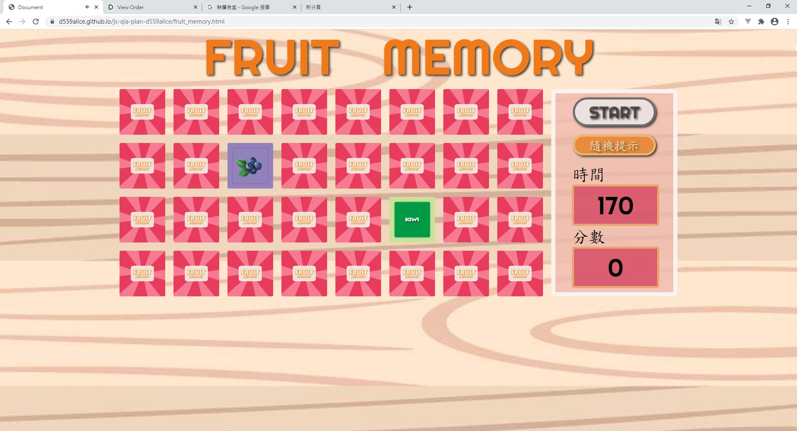
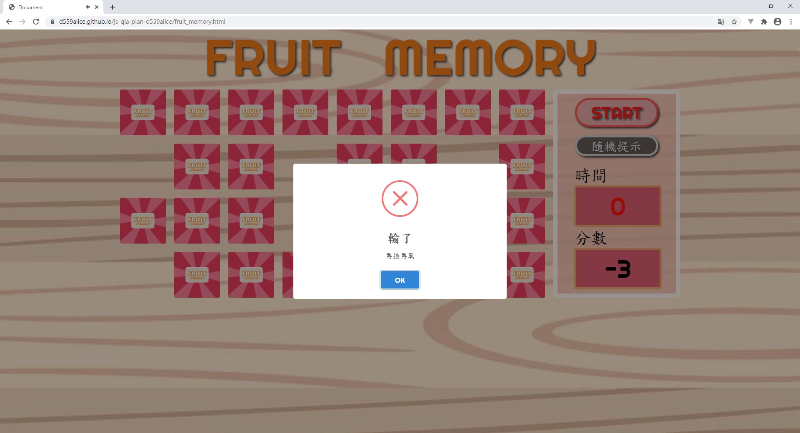

# 水果翻牌遊戲
### 遊戲說明
- 牌組分為兩組(圖片與英文字母)，翻牌須將水果圖片對應的到其英文單字，牌才可消失，且可獲得五分
- 遊戲開始後可以用隨機提示(隨機提示兩張牌)，每按一次隨機鈕，分數扣一分
- 時間內將牌組全部翻完且分數為正的即獲勝，未完成或分數是負數即失敗
- 本遊戲設有音效

###### 連結網址
https://d559alice.github.io/js-qia-pian-d559alice/fruit_memory.html
